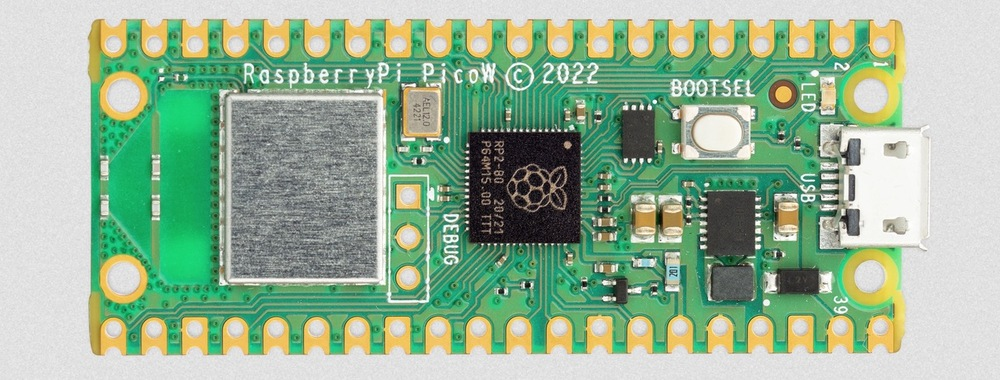
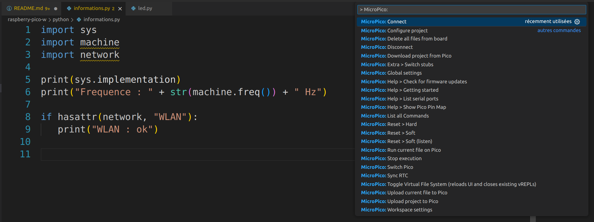
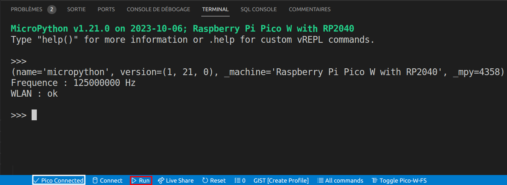
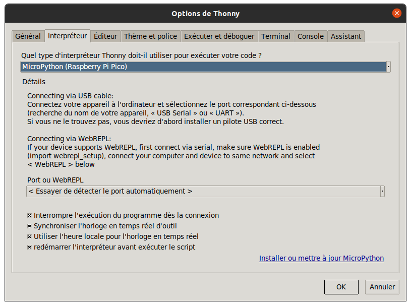
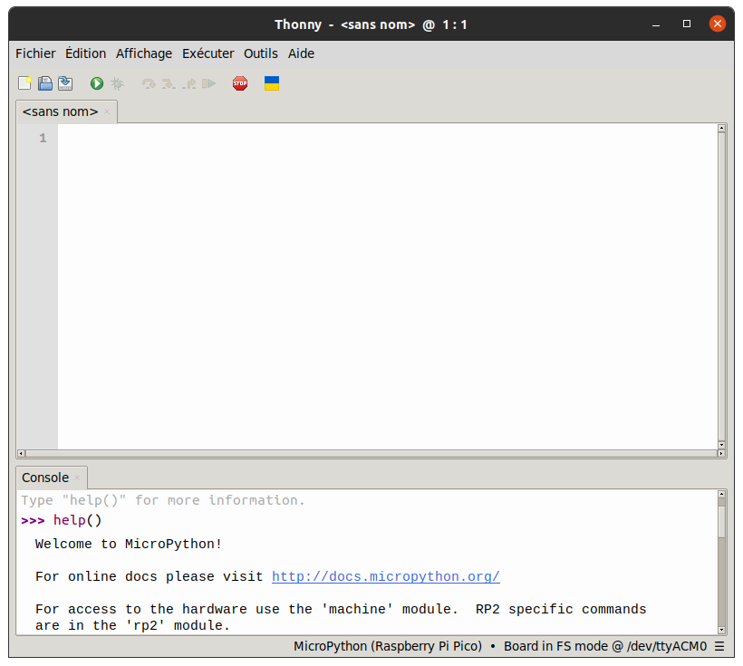
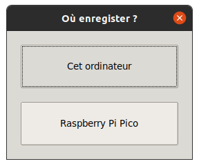
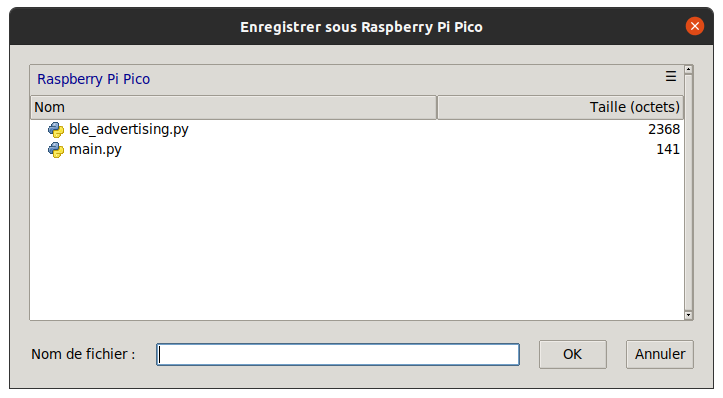

# Raspberry Pi Pico W

- [Raspberry Pi Pico W](#raspberry-pi-pico-w)
  - [Présentation](#présentation)
  - [Caractéristiques de base](#caractéristiques-de-base)
  - [Datasheets](#datasheets)
  - [Développement logiciel](#développement-logiciel)
  - [Mise en oeuvre MycroPython](#mise-en-oeuvre-mycropython)
    - [GNU/Linux](#gnulinux)
      - [Démarrage](#démarrage)
      - [Minicom](#minicom)
      - [LED intégrée à la carte](#led-intégrée-à-la-carte)
      - [mpremote](#mpremote)
      - [Informations sur la carte](#informations-sur-la-carte)
      - [Capteur de température intégré à la carte](#capteur-de-température-intégré-à-la-carte)
      - [Wifi](#wifi)
      - [Requête cliente HTTP et JSON](#requête-cliente-http-et-json)
      - [Serveur HTTP](#serveur-http)
      - [Bluetooth](#bluetooth)
      - [Programme exécuté au démarrage](#programme-exécuté-au-démarrage)
  - [Mise en oeuvre C/C++](#mise-en-oeuvre-cc)
    - [GNU/Linux](#gnulinux-1)
    - [Windows](#windows)
  - [IDE](#ide)
    - [Visual Studio Code](#visual-studio-code)
    - [Thonny](#thonny)

---

## Présentation

[Raspberry Pi Pico W](https://datasheets.raspberrypi.com/picow/pico-w-datasheet.pdf) est une carte basée sur le microcontrôleur [RP2040](https://datasheets.raspberrypi.com/rp2040/rp2040-datasheet.pdf) auquel a été ajoutée des interfaces sans fil WiFi 2,4 GHz (802.11n) et Bluetooth LE.



Présentation : https://www.raspberrypi.com/documentation/microcontrollers/raspberry-pi-pico.html

> Livre : [Get Started with MicroPython on Raspberry Pi Pico](https://store.rpipress.cc/collections/latest-bookazines/products/get-started-with-micropython-on-raspberry-pi-pico)

## Caractéristiques de base

- Dual-core Arm Cortex M0+ à 133 MHz
- SRAM 264kB
- Flash 2MB
- 26 × GPIO
- 2 × SPI, 2 × I2C, 2 × UART, 3 × 12-bit ADC, 16 × canaux PWM
- WiFi 2.4 GHz (802.11n)
- Bluetooth 5.2

Brochage : https://datasheets.raspberrypi.com/picow/PicoW-A4-Pinout.pdf


> Un _shield_ pour la Raspberry Pi Pico : https://wiki.keyestudio.com/KS3017_Keyestudio_Raspberry_Pico_IO_Shield

## Datasheets

- [Raspberry Pi Pico W](https://datasheets.raspberrypi.com/picow/pico-w-datasheet.pdf)
- [RP2040](https://datasheets.raspberrypi.com/rp2040/rp2040-datasheet.pdf)

## Développement logiciel

- [C/C++ SDK (PDF)](https://datasheets.raspberrypi.com/pico/raspberry-pi-pico-c-sdk.pdf) et [C/C++ SDK (HTML)](https://www.raspberrypi.com/documentation/microcontrollers/c_sdk.html)
- [Python (PDF)](https://datasheets.raspberrypi.com/pico/raspberry-pi-pico-python-sdk.pdf) et [Python (HTML)](https://www.raspberrypi.com/documentation/microcontrollers/micropython.html)

Firmware MicroPython : https://micropython.org/download/RPI_PICO_W/

Documentation MicroPython : https://docs.micropython.org/en/latest/

## Mise en oeuvre MycroPython

Les fonctionnalités actuellement prises en charge en MicroPython incluent :

- [REPL](https://docs.micropython.org/en/latest/reference/repl.html) (_shell_ Python) via USB et UART (on GP0/GP1)
- Système de fichier embarqué `littlefs2` de 1600kB (taille par défaut sur la Raspberry Pi Pico)
- module `utime`
- module `ubinascii`
- module `machine` avec les classes suivantes :
  - `machine.Pin`
  - `machine.Timer`
  - `machine.ADC`
  - `machine.I2C` et `machine.SoftI2C`
  - `machine.SPI` et `machine.SoftSPI`
  - `machine.WDT`
  - `machine.PWM`
  - `machine.UART`
- module spécifique `rp2`
◦ Bibliothèque matérielle PIO
◦ Assembleur PIO
- Support multicoeur avec le module `_thread`
- Bibliothèque pour l'arithmétique à virgule flottante

Flasher le _firmware_ [MycroPython](https://micropython.org/download/RPI_PICO_W/) :


### GNU/Linux

#### Démarrage

Maintenir l'appui sur le bouton `BOOTSEL` puis brancher la [Raspberry Pi Pico W](https://www.raspberrypi.com/documentation/microcontrollers/raspberry-pi-pico.html)

Accès au support de stockage de la carte :

```bash
$ ls -l /media/tv/RPI-RP2
total 8
-r--r--r-- 1 tv tv 241 sept.  5  2008 INDEX.HTM
-r--r--r-- 1 tv tv  62 sept.  5  2008 INFO_UF2.TXT
```

Informations sur la carte :

```bash
$ cat /media/tv/RPI-RP2/INFO_UF2.TXT
UF2 Bootloader v3.0
Model: Raspberry Pi RP2
Board-ID: RPI-RP2
```

```bash
$ bat /media/tv/RPI-RP2/INFO_UF2.TXT
───────┬───────────────────────────────────────────────────────────────────────────────────────────────────────────────────────────────────────────────────────────────────────────────────────
       │ File: /media/tv/RPI-RP2/INFO_UF2.TXT
───────┼───────────────────────────────────────────────────────────────────────────────────────────────────────────────────────────────────────────────────────────────────────────────────────
   1   │ UF2 Bootloader v3.0
   2   │ Model: Raspberry Pi RP2
   3   │ Board-ID: RPI-RP2
───────┴───────────────────────────────────────────────────────────────────────────────────────────────────────────────────────────────────────────────────────────────────────────────────────
```

```bash
$ cat /media/tv/RPI-RP2/INDEX.HTM
<html><head><meta http-equiv="refresh" content="0;URL='https://raspberrypi.com/device/RP2?version=E0C9125B0D9B'"/></head><body>Redirecting to <a href='https://raspberrypi.com/device/RP2?version=E0C9125B0D9B'>raspberrypi.com</a></body></html>
```

Installation du _firmware_ MicroPython :

- Télécharger le dernier _firmware_ :

> Voir aussi : https://micropython.org/download/RPI_PICO_W/

```bash
$ wget -c https://micropython.org/download/rp2-pico-w/rp2-pico-w-latest.uf2
--2023-12-15 18:21:03--  https://micropython.org/download/rp2-pico-w/rp2-pico-w-latest.uf2
Résolution de micropython.org (micropython.org)… 176.58.119.26
Connexion à micropython.org (micropython.org)|176.58.119.26|:443… connecté.
requête HTTP transmise, en attente de la réponse… 302 Found
Emplacement : /download/RPI_PICO_W/RPI_PICO_W-latest.uf2 [suivant]
--2023-12-15 18:21:03--  https://micropython.org/download/RPI_PICO_W/RPI_PICO_W-latest.uf2
Réutilisation de la connexion existante à micropython.org:443.
requête HTTP transmise, en attente de la réponse… 200 OK
Taille : 1604608 (1,5M) [application/force-download]
Enregistre : ‘rp2-pico-w-latest.uf2’

rp2-pico-w-latest.uf2                           100%[======================================================================================================>]   1,53M  --.-KB/s    ds 0,1s

2023-12-15 18:21:03 (10,4 MB/s) - ‘rp2-pico-w-latest.uf2’ enregistré [1604608/1604608]

$ file rp2-pico-w-latest.uf2
rp2-pico-w-latest.uf2: UF2 firmware image, family Raspberry Pi RP2040, address 0x10000000, 3134 total blocks
```

- Copier le dernier _firmware_ sur la carte :

```bash
$ cp rp2-pico-w-latest.uf2 /media/tv/RPI-RP2/
```

- Supprimer le _firmware_ téléchargé :

```bash
$ rm rp2-pico-w-latest.uf2
```

- Détection de la carte :

```bash
$ sudo dmesg
...
[3406470.011433] usb 1-6.4: new full-speed USB device number 25 using xhci_hcd
[3406470.125260] usb 1-6.4: New USB device found, idVendor=2e8a, idProduct=0005, bcdDevice= 1.00
[3406470.125264] usb 1-6.4: New USB device strings: Mfr=1, Product=2, SerialNumber=3
[3406470.125265] usb 1-6.4: Product: Board in FS mode
[3406470.125267] usb 1-6.4: Manufacturer: MicroPython
[3406470.125268] usb 1-6.4: SerialNumber: e66141040318442f
[3406470.133057] cdc_acm 1-6.4:1.0: ttyACM0: USB ACM device

$ lsusb
...
Bus 001 Device 025: ID 2e8a:0005 MicroPython Board in FS mode
...
```

- Le fichier de périphérique d'accès à la carte :

```bash
$ ls -l /dev/ttyACM0
crw-rw---- 1 root dialout 166, 0 déc.  15 18:21 /dev/ttyACM0
```

- Vérification pour l'accès :

> Il faut être membre du groupe `dialout`

```bash
$ echo ${USER}
tv
$ id
uid=1026(tv) gid=65536(tv) groupes=65536(tv),4(adm),20(dialout),24(cdrom),27(sudo),30(dip),46(plugdev),122(lpadmin),134(lxd),135(sambashare),140(wireshark),141(ubridge),142(libvirt)
$ cat /etc/group | grep dialout
dialout:x:20:tv
$ getent group dialout
dialout:x:20:tv
```

> Sinon :
>```bash
>$ sudo usermod -aG dialout ${USER}
>```
>

#### Minicom

[Minicom](https://salsa.debian.org/minicom-team/minicom) est un programme de contrôle de modem et d'émulation de terminal pour les systèmes d'exploitation de type Unix.

- Installaion de `minicom` :

```bash
$ apt-cache search minicom | grep minicom
minicom - programme de communication série piloté par menus conviviaux

$ apt-cache show minicom
Package: minicom
Architecture: amd64
Version: 2.8-2
Priority: optional
Section: universe/comm
Origin: Ubuntu
Maintainer: Ubuntu Developers <ubuntu-devel-discuss@lists.ubuntu.com>
Original-Maintainer: Martin A. Godisch <godisch@debian.org>
Bugs: https://bugs.launchpad.net/ubuntu/+filebug
Installed-Size: 1046
Depends: libc6 (>= 2.33), libtinfo6 (>= 6)
Recommends: lrzsz
Filename: pool/universe/m/minicom/minicom_2.8-2_amd64.deb
Size: 253336
MD5sum: 445afc625f33610ac08834752f65117a
SHA1: e8e05e10d94b047d455abe4f9e99191e2cefa48e
SHA256: defab53a8a5af7240a2b857806871d9ce7731043bafd38ad8ed4a268b1e644c2
SHA512: 5200a86c3e3348f12b5d6167c316fe34907dcc7f1dcb2f76b8438f752d978c4dbfcc3cbfa78ab96804d96e1d499319d418c8e8110529bb7b3c50e43cb12ebbe6
Homepage: https://salsa.debian.org/minicom-team/minicom
Description-fr: programme de communication série piloté par menus conviviaux
 Minicom est un clone du programme MS-DOS de communication « Telix ». Il
 émule les terminaux ANSI et VT102. Il possède un répertoire de numéros de
 téléphone et détecte automatiquement le téléchargement zmodem.
Description-md5: 3ce1c5251a28c8f9b5a9d1d702f7501e
```

Installation de `minicom` :

```bash
$ sudo apt install -y minicom
```

```bash
$ minicom --version
minicom version 2.8
Copyright © Miquel van Smoorenburg.

This program is free software; you can redistribute it and/or
modify it under the terms of the GNU General Public License
as published by the Free Software Foundation; either version
2 of the License, or (at your option) any later version.
```

```bash
$ minicom --help
Usage: minicom [OPTION]... [configuration]
A terminal program for Linux and other unix-like systems.

  -b, --baudrate         : set baudrate (ignore the value from config)
  -D, --device           : set device name (ignore the value from config)
  -s, --setup            : enter setup mode
  -o, --noinit           : do not initialize modem & lockfiles at startup
  -m, --metakey          : use meta or alt key for commands
  -M, --metakey8         : use 8bit meta key for commands
  -l, --ansi             : literal; assume screen uses non IBM-PC character set
  -L, --iso              : don't assume screen uses ISO8859
  -w, --wrap             : Linewrap on
  -H, --displayhex       : display output in hex
  -z, --statline         : try to use terminal's status line
  -7, --7bit             : force 7bit mode
  -8, --8bit             : force 8bit mode
  -c, --color=on/off     : ANSI style color usage on or off
  -a, --attrib=on/off    : use reverse or highlight attributes on or off
  -t, --term=TERM        : override TERM environment variable
  -S, --script=SCRIPT    : run SCRIPT at startup
  -d, --dial=ENTRY       : dial ENTRY from the dialing directory
  -p, --ptty=TTYP        : connect to pseudo terminal
  -C, --capturefile=FILE : start capturing to FILE
  --capturefile-buffer-mode=MODE : set buffering mode of capture file
  -F, --statlinefmt      : format of status line
  -R, --remotecharset    : character set of communication partner
  -v, --version          : output version information and exit
  -h, --help             : show help
  configuration          : configuration file to use

These options can also be specified in the MINICOM environment variable.
Cette variable est actuellement non définie.
Le répertoire de configuration pour les fichiers d'accès et de configuration
est compilé avec la valeur /etc/minicom.

Rapportez les bogues à <minicom-devel@lists.alioth.debian.org>.
```

```bash
$ tldr minicom

  minicom

  A program to communicate with the serial interface of a device.
  More information: https://manned.org/minicom.

  - Open a given serial port:
    sudo minicom --device /dev/ttyUSB0

  - Open a given serial port with a given baud rate:
    sudo minicom --device /dev/ttyUSB0 --baudrate 115200

  - Enter the configuration menu before communicating with a given serial port:
    sudo minicom --device /dev/ttyUSB0 --setup
```

- Test de connexion à la carte avec `minicom` :

```bash
$ minicom -o -D /dev/ttyACM0
Bienvenue dans minicom 2.8

OPTIONS: I18n
Port /dev/ttyACM0, 18:21:35

Tapez CTRL-A Z pour voir l'aide concernant les touches spéciales
```

> `Ctrl-d` pour démarrer (_soft reboot_)

```bash
MPY: soft reboot
MicroPython v1.21.0 on 2023-10-06; Raspberry Pi Pico W with RP2040
Type "help()" for more information.
>>> help()
Welcome to MicroPython!

For online docs please visit http://docs.micropython.org/

For access to the hardware use the 'machine' module.  RP2 specific commands
are in the 'rp2' module.

Quick overview of some objects:
  machine.Pin(pin) -- get a pin, eg machine.Pin(0)
  machine.Pin(pin, m, [p]) -- get a pin and configure it for IO mode m, pull mode p
    methods: init(..), value([v]), high(), low(), irq(handler)
  machine.ADC(pin) -- make an analog object from a pin
    methods: read_u16()
  machine.PWM(pin) -- make a PWM object from a pin
    methods: deinit(), freq([f]), duty_u16([d]), duty_ns([d])
  machine.I2C(id) -- create an I2C object (id=0,1)
    methods: readfrom(addr, buf, stop=True), writeto(addr, buf, stop=True)
             readfrom_mem(addr, memaddr, arg), writeto_mem(addr, memaddr, arg)
  machine.SPI(id, baudrate=1000000) -- create an SPI object (id=0,1)
    methods: read(nbytes, write=0x00), write(buf), write_readinto(wr_buf, rd_buf)
  machine.Timer(freq, callback) -- create a software timer object
    eg: machine.Timer(freq=1, callback=lambda t:print(t))

Pins are numbered 0-29, and 26-29 have ADC capabilities
Pin IO modes are: Pin.IN, Pin.OUT, Pin.ALT
Pin pull modes are: Pin.PULL_UP, Pin.PULL_DOWN

Useful control commands:
  CTRL-C -- interrupt a running program
  CTRL-D -- on a blank line, do a soft reset of the board
  CTRL-E -- on a blank line, enter paste mode

For further help on a specific object, type help(obj)
For a list of available modules, type help('modules')

>>> import sys
>>> sys.implementation
(name='micropython', version=(1, 21, 0), _machine='Raspberry Pi Pico W with RP2040', _mpy=4358)
```

Ceci donne accès au mode interpréteur interactif MicroPython (_shell_), alias [REPL](https://docs.micropython.org/en/latest/reference/repl.html) (_Read, Eval, Print, Loop_).

Documentation : https://docs.micropython.org/en/latest/reference/repl.html

#### LED intégrée à la carte

Pilotage de la LED intégrée à la carte (`GPIO0`) :

```python
>>> import machine
>>> led = machine.Pin("LED", machine.Pin.OUT)
>>> led.on()
>>> led.off()
>>> led.toggle()
>>> led.toggle()
>>> led
Pin(EXT_GPIO0, mode=OUT)
```

> `Ctrl-a q` pour quitter

Voir aussi :

-Le module [utime](https://docs.micropython.org/en/v1.8.7/esp8266/library/utime.html)

```python
>>> import utime
>>> utime.sleep(1)
```

- Importer des modules (_packages_) :

```python
>>> import upip
>>> upip.install("micropython-pystone_lowmem")
>>> import pystone_lowmem
>>> pystone_lowmem.main()
```

#### mpremote

L'outil de ligne de commande [mpremote](https://docs.micropython.org/en/latest/reference/mpremote.html) fournit un ensemble intégré d'utilitaires permettant d'interagir avec un périphérique MicroPython via une connexion série.

- Installation de `mpremote` :

```bash
$ pip install mpremote
Defaulting to user installation because normal site-packages is not writeable
Collecting mpremote
  Downloading mpremote-1.21.0-py3-none-any.whl.metadata (4.1 kB)
Requirement already satisfied: importlib-metadata>=1.4 in /usr/lib/python3/dist-packages (from mpremote) (4.6.4)
Collecting pyserial>=3.3 (from mpremote)
  Downloading pyserial-3.5-py2.py3-none-any.whl (90 kB)
     ━━━━━━━━━━━━━━━━━━━━━━━━━━━━━━━━━━━━━━━━ 90.6/90.6 kB 1.5 MB/s eta 0:00:00
Downloading mpremote-1.21.0-py3-none-any.whl (27 kB)
Installing collected packages: pyserial, mpremote
Successfully installed mpremote-1.21.0 pyserial-3.5
```

```bash
$ mpremote help
mpremote -- MicroPython remote control
See https://docs.micropython.org/en/latest/reference/mpremote.html

List of commands:
  connect     connect to given device
  disconnect  disconnect current device
  edit        edit files on the device
  eval        evaluate and print the string
  exec        execute the string
  fs          execute filesystem commands on the device
  help        print help and exit
  mip         install packages from micropython-lib or third-party sources
  mount       mount local directory on device
  repl        connect to given device
  resume      resume a previous mpremote session (will not auto soft-reset)
  rtc         get (default) or set the device RTC
  run         run the given local script
  sleep       sleep before executing next command
  soft-reset  perform a soft-reset of the device
  umount      unmount the local directory
  version     print version and exit
...
```

- Lister les périphériques séries :

```bash
$ mpremote connect list
/dev/ttyACM0 e66141040318442f 2e8a:0005 MicroPython Board in FS mode
/dev/ttyS0 None 0000:0000 None None
```

- Connexion à la carte :

```bash
$ mpremote connect port:/dev/ttyACM0
Connected to MicroPython at /dev/ttyACM0
Use Ctrl-] or Ctrl-x to exit this shell
help()
Welcome to MicroPython!

For online docs please visit http://docs.micropython.org/

For access to the hardware use the 'machine' module.  RP2 specific commands
are in the 'rp2' module.

Quick overview of some objects:
  machine.Pin(pin) -- get a pin, eg machine.Pin(0)
  machine.Pin(pin, m, [p]) -- get a pin and configure it for IO mode m, pull mode p
    methods: init(..), value([v]), high(), low(), irq(handler)
  machine.ADC(pin) -- make an analog object from a pin
    methods: read_u16()
  machine.PWM(pin) -- make a PWM object from a pin
    methods: deinit(), freq([f]), duty_u16([d]), duty_ns([d])
  machine.I2C(id) -- create an I2C object (id=0,1)
    methods: readfrom(addr, buf, stop=True), writeto(addr, buf, stop=True)
             readfrom_mem(addr, memaddr, arg), writeto_mem(addr, memaddr, arg)
  machine.SPI(id, baudrate=1000000) -- create an SPI object (id=0,1)
    methods: read(nbytes, write=0x00), write(buf), write_readinto(wr_buf, rd_buf)
  machine.Timer(freq, callback) -- create a software timer object
    eg: machine.Timer(freq=1, callback=lambda t:print(t))

Pins are numbered 0-29, and 26-29 have ADC capabilities
Pin IO modes are: Pin.IN, Pin.OUT, Pin.ALT
Pin pull modes are: Pin.PULL_UP, Pin.PULL_DOWN

Useful control commands:
  CTRL-C -- interrupt a running program
  CTRL-D -- on a blank line, do a soft reset of the board
  CTRL-E -- on a blank line, enter paste mode

For further help on a specific object, type help(obj)
For a list of available modules, type help('modules')
>>>
```

> `Ctrl-x` pour quitter

- Exécution de code Python :

```bash
$ mpremote exec 'import machine; led = machine.Pin("LED", machine.Pin.OUT); led.on();'
$ mpremote exec 'import machine; led = machine.Pin("LED", machine.Pin.OUT); led.off();'
```

- Édition du fichier source [python/led.py](python/led.py) :

```bash
$ vim led.py
```

```python
import machine
led = machine.Pin("LED", machine.Pin.OUT)
led.toggle()
```

- Exécution d'un script Python :

```
$ mpremote run led.py
$ mpremote run led.py
```

- Copier un fichier sur la carte :

```bash
$ mpremote fs cp ./python/led.py :main.py
```

- Lister les fichiers sur la carte :

```bash
$ mpremote fs ls
ls :
         141 main.py
```

> Un script nommé `main.py` sera exécuté automatiquement après le démarrage (_boot_) de la Raspberry Pi Pico.

#### Informations sur la carte

- Le script [python/informations.py](./python/informations.py) :

```python
import sys
import platform
import os
import machine
import network

#print(sys.implementation)
#print(sys.modules)
#print(sys.version)
#print(platform.platform())
#print(os.uname())

print("Carte : " + str(sys.implementation._machine))
print("Implementation : " + str(sys.implementation.name))
majeur, mineur, patch = sys.implementation.version
print("Version : " + str(majeur) + "." + str(mineur) + "." + str(patch))
print("Plateforme : " + str(sys.platform))
print(str(sys.byteorder) + " endian")

print("Frequence : " + str(machine.freq()) + " Hz")

if hasattr(network, "WLAN"):
   print("WLAN : ok")
```

On obtient :

```txt
Carte : Raspberry Pi Pico W with RP2040
Implementation : micropython
Version : 1.21.0
Plateforme : rp2
little endian
Frequence : 125000000 Hz
WLAN : ok
```

> Le module `rp2` (pour la famille de microcontrôleurs RP2xxx de la Raspberry Pi Foundation) prend en charge notamment la Raspberry Pi Pico qui utilise le RP2040. Documentation : https://docs.micropython.org/en/latest/rp2/general.html

#### Capteur de température intégré à la carte

Le microcontrôleur RP2040 de la Raspberry Pi Pico dispose d'un capteur de température interne sur le canal n°4 du convertisseur analogique-numérique (CAN).

Le convertisseur analogique-numérique (CAN) a une résolution de 12 bits, transformé en 16 bits pour des raisons de compatibilité avec les autres microcontrôleurs MicroPython.

> Les trois canaux de base sont reliés sur les broches GPIO suivantes : GP26 (`GP26_ADC0`), GP27 (`GP27_ADC1`) et GP28 (`GP28_ADC2`). Il existe également un canal n°4 sur lequel est relié un capteur de température intégré au [RP2040](https://datasheets.raspberrypi.com/rp2040/rp2040-datasheet.pdf) (Section 4.9.5 page 565).

Le capteur de température mesure la tension $V_{BE}$ d'une diode bipolaire polarisée, connectée au canal n°4. Typiquement, $V_{BE} = 0,706 V$ à 27 °C, avec une pente de -1,721 mV par degré.

La température peut donc être approchée comme suit :

$T = 27 - \frac{(U_{ADC} - 0.706)}{0.001721}$

> Un étalonnage serait nécessaire si des mesures précises sont requises.

```python
import machine

tensionPICO = 3.3
print("Tension Pico : " + str(tensionPICO) + " V")
quantumCAN = tensionPICO / 65535
print("Quantum CAN : " + str(quantumCAN*1000) + " mV")
capteurTemperature = machine.ADC(machine.ADC.CORE_TEMP)
print("Entree CAN : " + str(machine.ADC.CORE_TEMP))
valeurCAN = capteurTemperature.read_u16()
print("Valeur CAN : " + str(valeurCAN))
tensionCAN = valeurCAN * quantumCAN
print("Tension CAN : " + str(tensionCAN) + " V")
temperature = 27 - (tensionCAN - 0.706)/0.001721
print("Conversion : " + str(temperature) + " C")
print("Temperature : " + str(round(temperature)) + " C")
```

On obtient :

```bash
Tension Pico : 3.3 V
Quantum CAN : 0.05035477 mV
Entree CAN : 4
Valeur CAN : 14099
Tension CAN : 0.7099519 V
Conversion : 24.70368 C
Temperature : 25 C
```

#### Wifi

Documentations :

- Le module [network](https://docs.micropython.org/en/latest/library/network.html)
- La classe [WLAN](https://docs.micropython.org/en/latest/library/network.WLAN.html)

Exemple de connexion avec le script [python/wifi.py](./python/wifi.py) :

```python
import time
import network
import ubinascii

ssid = 'SSID'
password = 'PASSWORD'

wlan = network.WLAN(network.STA_IF)
wlan.active(True)
wlan.connect(ssid, password)

def connecterWiFi():
   # Connexion
   nbTentatives = 10
   while nbTentatives > 0:
      if wlan.status() < 0 or wlan.status() >= 3:
         break
      nbTentatives -= 1
      print('Attente de connexion...')
      time.sleep(1)

   # Connecté ?
   if wlan.status() != 3:
      raise RuntimeError('Erreur de connexion')
   else:
      print('SSID = ' + str(wlan.config('essid')))
      infos = wlan.ifconfig()
      adresseIP = infos[0]
      print('Adresse IP = ' + adresseIP)
      adresseMAC = ubinascii.hexlify(network.WLAN().config('mac'),':').decode()
      print('Adresse MAC = ' + adresseMAC)
      print('Canal = ' + str(wlan.config('channel')))
      print('TX Power = ' + str(wlan.config('txpower')))

def deconnecterWiFi():
   # Déconnexion
   wlan.disconnect()

connecterWiFi()

# ...

deconnecterWiFi()
```

On obtient :

```bash
...
SSID = Livebox-XXXX
Adresse IP = 192.168.1.45
Adresse MAC = 28:cd:c1:03:e4:a8
Canal = 8
TX Power = 31
```

Divers :

- Sélection du pays :

```python
import rp2
>>> rp2.country('FR')
>>> rp2.country()
```

- Désactivation du mode _power-saving_ :

```python
import network

wlan = network.WLAN(network.STA_IF)
wlan.active(True)
wlan.config(pm = 0xa11140)
```

#### Requête cliente HTTP et JSON

Objectif : mise en oeuvre des modules [urequests](https://makeblock-micropython-api.readthedocs.io/en/latest/public_library/Third-party-libraries/urequests.html) et [json](https://docs.micropython.org/en/latest/library/json.html) côté client.

- Exemple de requête HTTP `GET` avec le script [python/requete-http-get.py](./python/wifi.py) :

> Toutes les données de la saga [Star Wars](https://fr.wikipedia.org/wiki/Star_Wars) avec [SWAPI](https://swapi.dev/api/)

```python
import time
import network
import json
import urequests as requests

ssid = 'SSID'
password = 'PASSWORD'

wlan = network.WLAN(network.STA_IF)
wlan.active(True)
wlan.connect(ssid, password)

def connecterWiFi():
   # Connexion
   nbTentatives = 10
   while nbTentatives > 0:
      if wlan.status() < 0 or wlan.status() >= 3:
         break
      nbTentatives -= 1
      print('Attente de connexion...')
      time.sleep(1)

   # Connecté ?
   if wlan.status() != 3:
      raise RuntimeError('Erreur de connexion')
   else:
      print('SSID = ' + str(wlan.config('essid')))
      infos = wlan.ifconfig()
      adresseIP = infos[0]
      print('Adresse IP = ' + adresseIP)

def deconnecterWiFi():
   # Déconnexion
   wlan.disconnect()

connecterWiFi()

url = 'https://swapi.dev/api/people/1/'
print("Requete URL : " + url)
reponse = requests.get(url)
print("Code retour = " + str(reponse.status_code))
print("Message = " + str(reponse.reason))

personnage = reponse.json()
print("JSON : " + str(personnage))
print("Personnage 1 : " + personnage['name']) #'Luke Skywalker'
print("Poids : " + personnage['mass'] + " Kg") #'Luke Skywalker'
print("Taille : " + personnage['height'] + " m") #'Luke Skywalker'

deconnecterWiFi()
```

On obtient :

```bash
Attente de connexion...
SSID = Livebox-XXXX
Adresse IP = 192.168.1.45
Requete URL : https://swapi.dev/api/people/1/
Code retour = 200
Message = b'OK'
JSON : {'created': '2014-12-09T13:50:51.644000Z', 'mass': '77', 'species': [], 'films': ['https://swapi.dev/api/films/1/', 'https://swapi.dev/api/films/2/', 'https://swapi.dev/api/films/3/', 'https://swapi.dev/api/films/6/'], 'eye_color': 'blue', 'edited': '2014-12-20T21:17:56.891000Z', 'url': 'https://swapi.dev/api/people/1/', 'hair_color': 'blond', 'name': 'Luke Skywalker', 'birth_year': '19BBY', 'starships': ['https://swapi.dev/api/starships/12/', 'https://swapi.dev/api/starships/22/'], 'skin_color': 'fair', 'height': '172', 'gender': 'male', 'homeworld': 'https://swapi.dev/api/planets/1/', 'vehicles': ['https://swapi.dev/api/vehicles/14/', 'https://swapi.dev/api/vehicles/30/']}
Personnage 1 : Luke Skywalker
Poids : 77 Kg
Taille : 172 m
```

- Exemple de requête HTTP `POST` avec le script [python/requete-http-post.py](./python/wifi.py) :

> Utilisation d'une API _fake_ gratuite pour les tests et le prototypage : https://jsonplaceholder.typicode.com/

```python
import time
import network
import json
import urequests as requests

ssid = 'SSID'
password = 'PASSWORD'

wlan = network.WLAN(network.STA_IF)
wlan.active(True)
wlan.connect(ssid, password)

def connecterWiFi():
   # Connexion
   nbTentatives = 10
   while nbTentatives > 0:
      if wlan.status() < 0 or wlan.status() >= 3:
         break
      nbTentatives -= 1
      print('Attente de connexion...')
      time.sleep(1)

   # Connecté ?
   if wlan.status() != 3:
      raise RuntimeError('Erreur de connexion')
   else:
      print('SSID = ' + str(wlan.config('essid')))
      infos = wlan.ifconfig()
      adresseIP = infos[0]
      print('Adresse IP = ' + adresseIP)

def deconnecterWiFi():
   # Déconnexion
   wlan.disconnect()

connecterWiFi()

donneesJSON = json.dumps({'titre': 'hello world'})
# Free fake API for testing and prototyping
url = 'http://jsonplaceholder.typicode.com/posts'
print("Requete URL : " + url)
print("Donnees JSON : " + donneesJSON)
reponse = requests.post(url, data=donneesJSON)
print("Code retour = " + str(reponse.status_code))
print("Message = " + str(reponse.reason))
print("JSON : " + str(reponse.json()))

deconnecterWiFi()
```

On obtient :

```bash
Attente de connexion...
SSID = Livebox-XXXX
Adresse IP = 192.168.1.45
Requete URL : http://jsonplaceholder.typicode.com/posts
Donnees JSON : {"titre": "hello world"}
Code retour = 201
Message = b'Created'
JSON : {'id': 101}
```

#### Serveur HTTP

Objectif : mise en oeuvre des modules [socket](https://docs.micropython.org/en/v1.20.0/library/socket.html) et [uasyncio](https://docs.micropython.org/en/v1.20.0/library/uasyncio.html) côté serveur.

- Exemple de serveur HTTP basé sur les _sockets_ avec le script [python/serveur-http-socket.py](./python/serveur-http-socket.py) :

```python
import machine
import time
import network
import socket
import json

# Paramètres de connexion WiFi
ssid = 'SSID'
password = 'PASSWORD'

# Les réponses HTTP
reponseHTTPOk = """HTTP/1.1 200 OK
Content-Type: application/json
Content-Length: {length}
Server: MicroPython

{json}"""

reponseHTTPErreur = b"HTTP/1.1 404 File not found\r\n\r\n"

# L'interface WiFi (client d'un point d'accès WiFi)
wlan = network.WLAN(network.STA_IF)

# Les fonctions
def initialiserWiFi():
   wlan.active(True)
   wlan.config(pm = 0xa11140)

def connecterWiFi(ssid, password):
   wlan.connect(ssid, password)
   # Connexion
   nbTentatives = 10
   while nbTentatives > 0:
      if wlan.status() < 0 or wlan.status() >= 3:
         break
      nbTentatives -= 1
      print('Attente de connexion...')
      time.sleep(1)

   # Connecté ?
   if wlan.status() != 3:
      raise RuntimeError('Erreur de connexion')
   else:
      print('SSID = ' + str(wlan.config('essid')))
      infos = wlan.ifconfig()
      adresseIP = infos[0]
      print('Adresse IP = ' + adresseIP)

def deconnecterWiFi():
   # Déconnexion
   wlan.disconnect()

def creerSocketEcoute():
   ADRESSE_ECOUTE = '0.0.0.0' # toutes les interfaces
   PORT_ECOUTE = 80
   pointCommunicationLocal = socket.getaddrinfo(ADRESSE_ECOUTE, PORT_ECOUTE)[0][-1]
   s = socket.socket()
   s.bind(pointCommunicationLocal)
   s.listen(1)
   print('Ecoute serveur sur', pointCommunicationLocal)
   return s

def getTemperature():
   tensionPICO = 3.3
   quantumCAN = tensionPICO / 65535
   capteurTemperature = machine.ADC(machine.ADC.CORE_TEMP)
   valeurCAN = capteurTemperature.read_u16()
   tensionCAN = valeurCAN * quantumCAN
   temperature = 27 - (tensionCAN - 0.706)/0.001721
   return temperature

# Le serveur HTTP
initialiserWiFi()

connecterWiFi(ssid, password)

socketEcoute = creerSocketEcoute()

# c'est un serveur ;)
while True:
   try:
      socketDialogue, pointCommunicationDistant = socketEcoute.accept()
      print('Client connecté : ', pointCommunicationDistant)
      # Voir aussi : makefile()
      # https://docs.micropython.org/en/v1.20.0/library/socket.html
      # Reception des données
      requete = socketDialogue.recv(1024)
      print("Requete recue : " + str(requete))
      requete = str(requete)
      if(requete.find('/temperature') != -1):
         donneesJSON = json.dumps({'temperature': str(getTemperature())})
         reponse = reponseHTTPOk.format(length=len(donneesJSON), json=donneesJSON)
         print("Reponse envoyee : " + str(reponse))
         socketDialogue.send(reponse)
         socketDialogue.close()
      else:
         print("Reponse envoyee : " + str(reponseHTTPErreur))
         socketDialogue.send(reponseHTTPErreur)
         socketDialogue.close()
      print('Deconnexion : ', pointCommunicationDistant)
   except OSError as e:
      socketDialogue.close()
      print('Deconnexion : ', pointCommunicationDistant)

deconnecterWiFi()
```

Tests client :

- avec `curl`

```bash
$ curl --location 'http://192.168.1.45/temperature' --header 'Accept: application/json'
{"temperature": "27.0444"}
```

- avec `wget`

```bash
$ wget --server-response -qO- 'http://192.168.1.45/temperature'
  HTTP/1.1 200 OK
  Content-Type: application/json
  Content-Length: 27
  Server: MicroPython
{"temperature": "30.78955"}

$ wget --server-response -qO- 'http://192.168.1.45/'
  HTTP/1.1 404 File not found
```

On obtient sur le serveur :

```bash
Attente de connexion...
SSID = Livebox-XXXX
Adresse IP = 192.168.1.45
Ecoute serveur sur ('0.0.0.0', 80)
Client connecté :  ('192.168.1.23', 38692)
Requete recue : b'GET /temperature HTTP/1.1\r\nHost: 192.168.1.45\r\nUser-Agent: curl/7.81.0\r\nAccept: application/json\r\n\r\n'
Reponse envoyee : HTTP/1.1 200 OK
Content-Type: application/json
Content-Length: 26
Server: MicroPython

{"temperature": "27.0444"}
Déconnexion :  ('192.168.1.23', 38692)
...
Client connecté :  ('192.168.1.23', 54058)
Requete recue : b'GET /temperature HTTP/1.1\r\nHost: 192.168.1.45\r\nUser-Agent: Wget/1.21.2\r\nAccept: */*\r\nAccept-Encoding: identity\r\nConnection: Keep-Alive\r\n\r\n'
Reponse envoyee : HTTP/1.1 200 OK
Content-Type: application/json
Content-Length: 27
Server: MicroPython

{"temperature": "30.78955"}
Deconnexion :  ('192.168.1.23', 54058)
Client connecté :  ('192.168.1.23', 41046)
Requete recue : b'GET / HTTP/1.1\r\nHost: 192.168.1.45\r\nUser-Agent: Wget/1.21.2\r\nAccept: */*\r\nAccept-Encoding: identity\r\nConnection: Keep-Alive\r\n\r\n'
Reponse envoyee : b'HTTP/1.1 404 File not found\r\n\r\n'
Deconnexion :  ('192.168.1.23', 41046)
```

- Exemple de serveur HTTP asynchrone avec le script [python/serveur-http-uasyncio.py](./python/serveur-http-uasyncio.py) :

```python
import machine
import time
import network
import socket
import json
import uasyncio as asyncio

# Basé sur https://gist.github.com/aallan/3d45a062f26bc425b22a17ec9c81e3b6

# Paramètres de connexion WiFi
ssid = 'SSID'
password = 'PASSWORD'

# La led embarquée
led = machine.Pin("LED", machine.Pin.OUT)

# Les réponses HTTP
reponseHTTPOk = """HTTP/1.1 200 OK
Content-Type: application/json
Content-Length: {length}
Server: MicroPython

{json}"""

reponseHTTPErreur = b"HTTP/1.1 404 File not found\r\n\r\n"

# L'interface WiFi (client d'un point d'accès WiFi)
wlan = network.WLAN(network.STA_IF)

# Les fonctions
def initialiserWiFi():
   wlan.active(True)
   wlan.config(pm = 0xa11140)

def connecterWiFi(ssid, password):
   wlan.connect(ssid, password)
   # Connexion
   nbTentatives = 10
   while nbTentatives > 0:
      if wlan.status() < 0 or wlan.status() >= 3:
         break
      nbTentatives -= 1
      print('Attente de connexion...')
      time.sleep(1)

   # Connecté ?
   if wlan.status() != 3:
      raise RuntimeError('Erreur de connexion')
   else:
      print('SSID = ' + str(wlan.config('essid')))
      infos = wlan.ifconfig()
      adresseIP = infos[0]
      print('Adresse IP = ' + adresseIP)

def deconnecterWiFi():
   # Déconnexion
   wlan.disconnect()

def getTemperature():
   tensionPICO = 3.3
   quantumCAN = tensionPICO / 65535
   capteurTemperature = machine.ADC(machine.ADC.CORE_TEMP)
   valeurCAN = capteurTemperature.read_u16()
   tensionCAN = valeurCAN * quantumCAN
   temperature = 27 - (tensionCAN - 0.706)/0.001721
   return temperature

# Le serveur HTTP
ADRESSE_ECOUTE = '0.0.0.0' # toutes les interfaces
PORT_ECOUTE = 80

async def demarrerServeurHTTP(reader, writer):
   print('Client connecté')
   requete = await reader.readline()
   print("Requete recue : " + str(requete))
   # Ignorer les en-têtes HTTP
   while await reader.readline() != b"\r\n":
      pass
   requete = str(requete)
   if(requete.find('/temperature') != -1):
      donneesJSON = json.dumps({'temperature': str(getTemperature())})
      reponse = reponseHTTPOk.format(length=len(donneesJSON), json=donneesJSON)
      print("Reponse envoyee : " + str(reponse))
      writer.write(reponse)
      await writer.drain()
      await writer.wait_closed()
   else:
      print("Reponse envoyee : " + str(reponseHTTPErreur))
      writer.write(reponseHTTPErreur)
      await writer.drain()
      await writer.wait_closed()
   print('Deconnexion')

async def main():
   initialiserWiFi()
   connecterWiFi(ssid, password)
   asyncio.create_task(asyncio.start_server(demarrerServeurHTTP, ADRESSE_ECOUTE, PORT_ECOUTE))
   while True:
      led.on()
      await asyncio.sleep(0.25)
      led.off()
      await asyncio.sleep(5)

try:
    asyncio.run(main())
finally:
    asyncio.new_event_loop()

deconnecterWiFi()
```

Tests client avec `wget` :

```bash
$ wget --server-response -qO- 'http://192.168.1.45/'
  HTTP/1.1 404 File not found

$ wget --server-response -qO- 'http://192.168.1.45/temperature'
  HTTP/1.1 200 OK
  Content-Type: application/json
  Content-Length: 27
  Server: MicroPython
{"temperature": "27.98069"}
```

On obtient :

```bash
SSID = Livebox-XXXX
Adresse IP = 192.168.1.45
Client connecté
Requete recue : b'GET / HTTP/1.1\r\n'
Reponse envoyee : b'HTTP/1.1 404 File not found\r\n\r\n'
Deconnexion

Client connecté
Requete recue : b'GET /temperature HTTP/1.1\r\n'
Reponse envoyee : HTTP/1.1 200 OK
Content-Type: application/json
Content-Length: 27
Server: MicroPython

{"temperature": "27.98069"}
Deconnexion

```

#### Bluetooth

Le module [bluetooth](https://docs.micropython.org/en/latest/library/bluetooth.html)

> Les exemples en C/C++ : [Pico W Bluetooth](https://github.com/raspberrypi/pico-examples#pico-w-bluetooth)

Exemple de transmission UART sur BLE avec le script [python/peripherique-bluetooth-ble.py](./python/peripherique-bluetooth-ble.py) :

```txt
Nom peripherique : picow
Demarre l'annonce (advertising)
Temperature : 31.73 C
Donnees envoyees :  b'640c'
Connecte :  b'738211c76413'
Temperature : 31.73 C
Donnees envoyees :  b'640c'
Donnees recues :  b'$hello\r\n'
Temperature : 31.73 C
Donnees envoyees :  b'640c'
```

> Le programme ci-dessus nécessite des fonctions définies dans le script [ble_advertising.py](./python/ble_advertising.py) qui doit être présent sur le système de fichier embarqué `littlefs2` de la Raspberry Pi Pico W :

```bash
$ mpremote a0 fs cp ./python/ble_advertising.py :ble_advertising.py

$ mpremote a0 fs ls
ls :
        2368 ble_advertising.py
         141 main.py
```

#### Programme exécuté au démarrage

Le programme lancé après le démarrage (_boot_) de la Raspberry Pi Pico se nomme `main.py`.

> Evidemment, celui-ci doit être stocké sur le système de fichier embarqué `littlefs2` de la carte. On peut le télécharger avec [mpremote](#mpremote) ou via l'IDE [Thonny](#thonny).

## Mise en oeuvre C/C++

Liens :

- [C/C++ SDK (PDF)](https://datasheets.raspberrypi.com/pico/raspberry-pi-pico-c-sdk.pdf) 
- [C/C++ SDK (HTML)](https://www.raspberrypi.com/documentation/microcontrollers/c_sdk.html)

### GNU/Linux

L'installation sera réalisée dans le répertoire `/home/$USER/pico` :

```bash
$ cd ~/
$ mkdir pico
$ cd pico
$ pwd
/home/$USER/pico
```

Récupération du [kit de développement logiciel](https://fr.wikipedia.org/wiki/Kit_de_d%C3%A9veloppement) (SDK) et des exemples :

```bash
$ git clone https://github.com/raspberrypi/pico-sdk.git --branch master
$ cd pico-sdk
$ git submodule update --init
$ cd ..
$ git clone https://github.com/raspberrypi/pico-examples.git --branch master
```

> Mettre à jour le [SDK](https://fr.wikipedia.org/wiki/Kit_de_d%C3%A9veloppement) :
>```bash
> $ cd pico-sdk
> $ git pull
> $ git submodule update
>```

Pour créer des applications pour la carte Raspbery Pi Pico, il faut ensuite installer localement une [chaîne de compilation croisée](https://fr.wikipedia.org/wiki/Cha%C3%AEne_de_compilation) (_toolchain_ and _cross compiler_) pour processeur [ARM](https://fr.wikipedia.org/wiki/Architecture_ARM) :

```bash
$ sudo apt update
$ sudo apt install cmake gcc-arm-none-eabi libnewlib-arm-none-eabi build-essential

$ arm-none-eabi-g++ --version
arm-none-eabi-g++ (15:9-2019-q4-0ubuntu1) 9.2.1 20191025 (release) [ARM/arm-9-branch revision 277599]
Copyright (C) 2019 Free Software Foundation, Inc.
This is free software; see the source for copying conditions.  There is NO
warranty; not even for MERCHANTABILITY or FITNESS FOR A PARTICULAR PURPOSE.

$ cmake --version
cmake version 3.16.3

CMake suite maintained and supported by Kitware (kitware.com/cmake).
```

Il faut fixer la variable d'environnement `PICO_SDK_PATH` :

```bash
$ export PICO_SDK_PATH=~/pico/pico-sdk
```

> cf. le fichier `~/.bashrc`

Liste des exemples :

```bash
$ ls -l ~/pico/pico-examples/

$ ls -l ~/pico/pico-examples/blink/
total 8,0K
-rw-rw-r-- 1 tvaira tvaira 484 déc.  22 10:34 blink.c
-rw-rw-r-- 1 tvaira tvaira 245 déc.  22 10:34 CMakeLists.txt
```

Test du clignotement de la Led intégrée (Pico W) :

```bash
$ cd ~/pico/pico-examples/pico_w/wifi/blink/

$ bat picow_blink.c
───────┬────────────────────────────────────────────────────────────────────────────────────────────────────────────────────────────────────────────────────────────────
       │ File: ./picow_blink.c
───────┼────────────────────────────────────────────────────────────────────────────────────────────────────────────────────────────────────────────────────────────────
   1   │ /**
   2   │  * Copyright (c) 2022 Raspberry Pi (Trading) Ltd.
   3   │  *
   4   │  * SPDX-License-Identifier: BSD-3-Clause
   5   │  */
   6   │ 
   7   │ #include "pico/stdlib.h"
   8   │ #include "pico/cyw43_arch.h"
   9   │ 
  10   │ int main() {
  11   │     stdio_init_all();
  12   │     if (cyw43_arch_init()) {
  13   │         printf("Wi-Fi init failed");
  14   │         return -1;
  15   │     }
  16   │     while (true) {
  17   │         cyw43_arch_gpio_put(CYW43_WL_GPIO_LED_PIN, 1);
  18   │         sleep_ms(250);
  19   │         cyw43_arch_gpio_put(CYW43_WL_GPIO_LED_PIN, 0);
  20   │         sleep_ms(250);
  21   │     }
  22   │ }
───────┴────────────────────────────────────────────────────────────────────────────────────────────────────────────────────────────────────────────────────────────────

$ mkdir build && cd build
```

Dans le fichier `CMakeLists.txt` :

```cmake
CMAKE_MINIMUM_REQUIRED(VERSION 3.16)

# initialize the SDK based on PICO_SDK_PATH
# note: this must happen before project()
include($ENV{PICO_SDK_PATH}/external/pico_sdk_import.cmake)

project(picow_blink C CXX ASM)

# initialize the Raspberry Pi Pico SDK
pico_sdk_init()

add_executable(picow_blink
        picow_blink.c
        )

# pull in common dependencies
target_link_libraries(picow_blink
        pico_stdlib              # for core functionality
        pico_cyw43_arch_none     # we need Wifi to access the GPIO, but we don't need anything else
        )

# create map/bin/hex/uf2 file etc.
pico_add_extra_outputs(picow_blink)

# enable usb output, disable uart output
pico_enable_stdio_usb(${PROJECT_NAME} 1)
pico_enable_stdio_uart(${PROJECT_NAME} 0)
```

Fabrication :

```bash
$ cmake -DPICO_BOARD=pico_w ..

$ make

$ ls -l picow_blink.uf2
-rw-rw-r-- 1 tvaira tvaira 551424 déc.  22 11:40 picow_blink.uf2
```

Maintenir l'appui sur le bouton `BOOTSEL` puis brancher la [Raspberry Pi Pico W](https://www.raspberrypi.com/documentation/microcontrollers/raspberry-pi-pico.html)

Copier le fichier `picow_blink.uf2` sur la carte :

```bash
$ cp ./picow_blink.uf2 /media/$USER/RPI-RP2/
$ sudo sync
```

### Windows

> Installateur C/C++ SDK pour Windows 10/11 : [pico-setup-windows-x64-standalone.exe](https://github.com/raspberrypi/pico-setup-windows/releases/latest/download/pico-setup-windows-x64-standalone.exe)

## IDE

### Visual Studio Code

[MicroPico](https://github.com/paulober/MicroPico) est une extension Visual Studio Code conçue pour le développement de projets MicroPython pour les cartes Raspberry Pi Pico et Pico W.

Liens :

- https://github.com/paulober/MicroPico
- https://marketplace.visualstudio.com/items?itemName=paulober.pico-w-go

Installation :

```bash
$ code --install-extension ms-python.python
$ code --install-extension visualstudioexptteam.vscodeintellicode
$ code --install-extension ms-python.vscode-pylance
$ code --install-extension paulober.pico-w-go
```

Les commandes disponibles :



Une fois connectée à la Raspberry Pi Pico W, on peut exécuter un script Python :



### Thonny

[Thonny](https://thonny.org/) est un IDE Python pour débutants.

```bash
$ sudo apt-get install python3-tk
$ pip3 install thonny
```

Puis aller dans Outils (_Tools_) > _Options_ > Interpréteur (_Interpreter_) et sélectionner "MicroPython (Raspberry Pi Pico)"



Une fois connecté à la carte (ici sur le port `/dev/ttyACM0`), [Thonny](https://thonny.org/) donne un accès au RELP (_Shell_ Python) :



L'IDE permet de choisir la localisation des fichiers à éditer :



Les fichiers du système de fichier embarqué `littlefs2` de la Raspberry Pi Pico W :



---
&copy; 2023 LaSalle Avignon - Thierry VAIRA <<thierry.vaira@gmail.com>>
